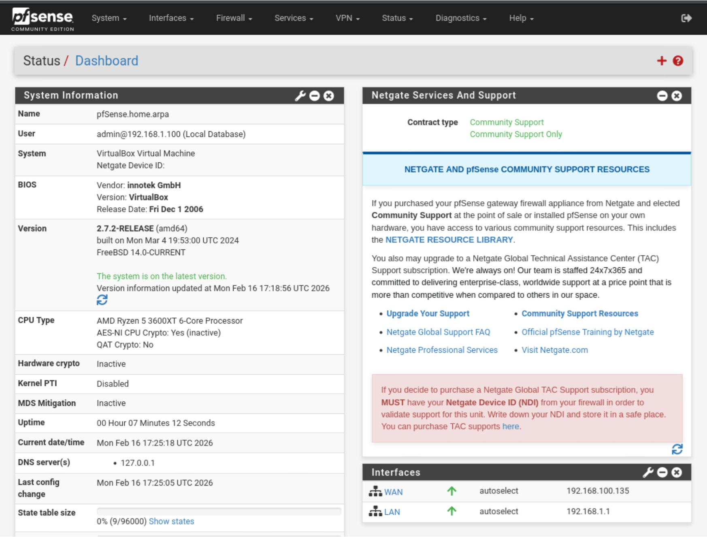

# pfSense
Gateway padrão da rede do laboratório virtual, responsável pelo roteamento e regras de firewall.

[**EN-US**](../README.md)

## Dependências
- [Oracle VirtualBox](https://www.virtualbox.org/) — Plataforma de virtualização;
- [pfSense CE](https://shop.netgate.com/products/netgate-installer) — ISO do Netgate Installer.

## Primeiros Passos

  
Configuração da Máquina Virtual

  - Memória Base: 1024 MB;
  - Número de CPUs: 1 CPU;
  - Tamanho do Disco: 8 GB.

  Crie uma nova VM e adicione duas Placas de Interface de Rede (NICs):
  1. **Adaptador 1** — WAN (NAT ou Bridge);
  2. **Adaptador 2** — LAN (Rede Interna - homelab).

  
Configuração do pfSense

  1. Usuário padrão: admin
  2. Senha padrão: pfsense

  - Altere a senha no Gerenciador de Usuários;
  - Endereço IP: 192.168.1.1/24;
  - Faixa DHCP: 192.168.1.100 - 192.168.1.199;
  - IPv6 desabilitado para evitar ruído na análise de pacotes.
  

## Uso

  
Gerenciando a Rede

  Você pode alternar a conexão de rede marcando ou desmarcando `[ ] Virtual Cable Connection` nas configurações de rede da VM do pfSense (Adaptador 1 - WAN).

  - **Acesso à internet:**
  Habilite a conexão do cabo no Adaptador 1. O pfSense roteará o tráfego da rede interna através da sua máquina host.

  - **Ambiente isolado:**
  Desabilite a conexão do cabo no Adaptador 1. A rede interna permanece ativa, mas sem acesso externo — recomendado para análise segura de malware ou testes controlados.

  
Atualizando o pfSense

  1. **Faça backup da configuração atual:** Diagnostics → Backup & Restore → Download configuration as XML
  2. **Remova pacotes instalados:** System → Package Manager → Installed Packages
  3. **Atualize o sistema:** System → Update → Confirm
  4. **Se algo der errado, restaure o backup em** Diagnostics → Backup & Restore

